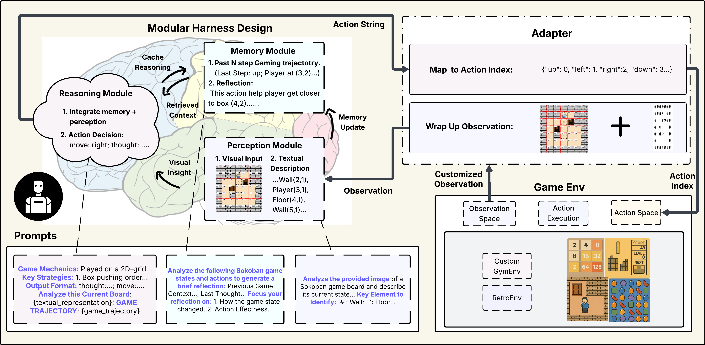

<p align="center">

</p>

<div align="center"> <h1>LMGame Bench and Gaming Agent</h1> </div> 
<p align="center"> <a href="https://arxiv.org/pdf/2505.15146"><b>📜 Paper</b></a> | <a href="https://huggingface.co/spaces/lmgame/game_arena_bench"><b>🏆 Leaderboard</b></a> | <a href="https://www.youtube.com/channel/UCmuHTmXPhmqYlzNySc6woFw"><b>📺 Gallery</b></a> | <a href="https://lmgame.org/#/gaming_agent"><b>🌐 Website</b></a></p>

## Introduction

This repo consists of two main features:
1. Evaluating state-of-the-art models with a suite of diverse video games in both single-model VLM (without gaming harness) setting.
2. Deploying and evaluating models with GamingAgent workflow (gaming harness) to improve model gaming performance.

<p align="center">
  <picture>
  
  </picture>
</p>


## Contents
- [News](#News)
- [Installation](#installation)
- [APIs](#apis)
- [Lmgame Bench](#lmgame-bench)
  - [Setup](#setup)
  - [Single-Model Performance](#single-model-performance)
  - [Agentic Performance](#agentic-performance)
- [Computer-Use Gaming Agents](#computer-use-gaming-agents)
- [Add Your Own Games](#add-your-own-games)

## News 🔥

- [2025/6] Lmgame Bench is officially released! Check out our [paper](https://arxiv.org/pdf/2505.15146) and [leaderboard](https://huggingface.co/spaces/lmgame/game_arena_bench) for more details.
- [2025/3] We built gaming agents and tested different models on classical video games. See our [Youtube Channel](https://www.youtube.com/channel/UCmuHTmXPhmqYlzNySc6woFw) for side-by-side comparisons!

## Installation

1. Clone this repository:
```
git clone https://github.com/lmgame-org/GamingAgent.git
cd GamingAgent
```
2. Install dependency:
```
conda create -n lmgame python==3.10 -y
conda activate lmgame
pip install -e .
```

## APIs

Currently we support gaming agents based on the following models:

- OpenAI:
  - o4-mini
  - o3-mini, o3
  - o1
  - gpt-4o
  - gpt-4o-mini
- Anthropic:
  - claude-4-opus, claude-4-sonnet (with thinking mode)
  - claude-3-7-sonnet (with thinking mode)
  - claude-3-5-haiku, claude-3-5-sonnet
- Gemini:
  - gemini-2.5-pro, gemini-2.5-flash
  - gemini-2.0-flash-thinking-exp
  - gemini-2.0-pro, gemini-2.0-flash
  - gemini-1.5-pro
- xAI:
  - grok-3-mini
- Deepseek:
  - reasoner (R1)
  - chat (V3)
- Qwen:
  - Qwen3
 
Check out our [leaderboard](https://huggingface.co/spaces/lmgame/game_arena_bench) to see how their performances compare with each other!

To test the models yourself, set your API keys in `credentials.sh` with:

```
export OPENAI_API_KEY={YOUR_OPENAI_API_KEY}
export ANTHROPIC_API_KEY={YOUR_ANTHROPIC_API_KEY}
export GEMINI_API_KEY={YOUR_GEMINI_API_KEY}
export XAI_API_KEY={YOUR_XAI_API_KEY}
export DEEPSEEK_API_KEY={YOUR_DEEPSEEK_API_KEY}
```

⚠️ **Evaluating or deploying the agents with high-end models could incur higher costs!**

## Lmgame Bench

### Setup

#### Gym and Retro Interface

##### Gymnasium Envrionments

We standardize our gaming envrionment interfaces following [Gymnasium](https://github.com/Farama-Foundation/Gymnasium).

Currently our evaluation suite composes of the following games using gym envrionments:

- Sokoban
- Tetris
- 2048
- Candy Crush

all runnable out-of-the-box with no additional setup.

##### Retro Envrionments

Gym [Retro](https://github.com/Farama-Foundation/stable-retro) is a library that enables classic video game emulation through a wide range of supported systems, providing a standardized interface via Gymnasium.

To run classical games implemented on Retro, you need to legally obtain the games files and import them with [this instruction](https://retro.readthedocs.io/en/latest/getting_started.html#importing-roms):

```
python3 -m retro.import /path/to/your/ROMs/directory/
```

Currently our evaluation suite composes of the following games using retro envrionments:

- Super Mario Bros 1985
- Ace Attorney: Phoenix Wright

#### UI-only Interface

Coming Soon!


### Single-Model Performance

Launch multiple evaluation instances (in parallel) for a model on different games with the following commands:

```
bash gamingagent/run.py --model_name {model_name} --game_names {list_of_games} --harness_mode false
```

To multiple models in parallel, run the following script:

```
bash gamingagent/evaluate_all.sh
```

### Agentic Performance

Evaluate a model's performance in gaming agent (with gaming harness support), run the following command:

```
bash gamingagent/run.py --model_name {model_name} --game_names {list_of_games} --harness_mode true
```

##### Command options

```
--harness_mode if to evaluate the model using agentic workflow, choice of ["true", "false", "both"].
--max_parallel_procs max parallel instances to run.
-- game_names list of games to evaluated on, e.g. "sokoban,tetris,candy_crush,twenty_forty_eight".

Currently supported games:
- sokoban
- tetris
- candy_crush
- twenty_forty_eight
- super_mario_bros
- ace_attorney
```

## Computer-Use Gaming Agents

We support computer-use gaming agents to run state-of-the-art models live on your local PCs and laptops! Check out [computer_use](computer_use) for detailed instructions!

## Add Your own Games

#### Gym and Retro Interface

1. You can follow instructions from [Gymnasium](https://gymnasium.farama.org/introduction/create_custom_env/) (for your own game implementation) or [Gym Retro](https://retro.readthedocs.io/en/latest/integration.html) (for existing classical games) to integrate a gaming environment with standarized interface. 

2. Navigate to [gamingagent/envs](gamingagent/envs). Set up your gaming environment to connect with an LLM/VLM gaming agent by implementing observation making and agent action processing methods.

3. Add your agent configuration to [configs](configs) so that a gaming agent can interface properly the envrionment.

#### UI-only Interface

Coming Soon!
